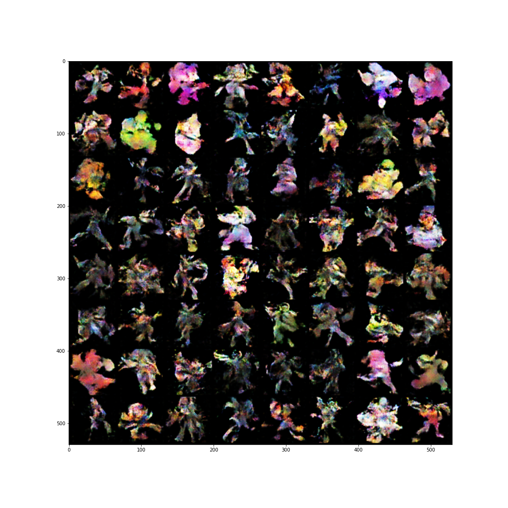

# smash-gan
:facepunch: Generating new Super Smash Bros. Ultimate characters using GANs.

## Overview

This repository contains an implementation of the DCGAN algorithm applied to the problem of generating new Super Smash Bros. Ultimate characters.

To reproduce the results, follow these steps:

1. Install all requirements: `pip install -r requirements.txt`.
1. Download the character images: `python download_characters.py`.
1. Prepare the dataset: `python prepare_dataset.py`.
1. Run the Jupyter Notebook.

## Results

The following figure shows a sample of 64 generated character images. Although the results are not particularly impressive, and still very "blob-y"; we can see that the model was able to learn some of the fundamental elements that form the characters. For example, we can distinguish some legs, arms and weapon-like silhouettes; as well as, fighting poses.

  

## Future Work

Probably one of the most obvious next step would be to try more modern and better algorithms. The original character images are actually high resolution which could be leveraged by using something like StyleGAN.

## References

- [Unsupervised Representation Learning with Deep Convolutional Generative Adversarial Networks](https://arxiv.org/abs/1511.06434)
- [Image Augmentations for GAN Training](https://arxiv.org/abs/2006.02595)
- [Training Generative Adversarial Networks with Limited Data](https://arxiv.org/abs/2006.06676)
- [DCGAN PyTorch tutorial](https://pytorch.org/tutorials/beginner/dcgan_faces_tutorial.html)